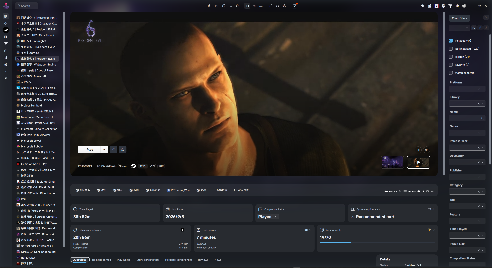
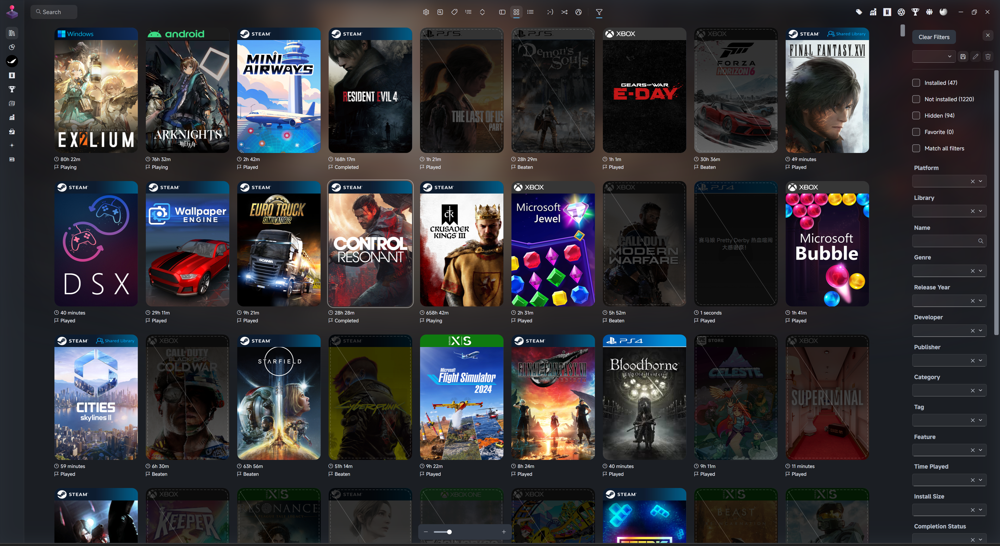
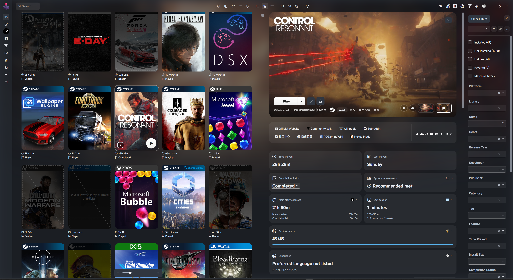
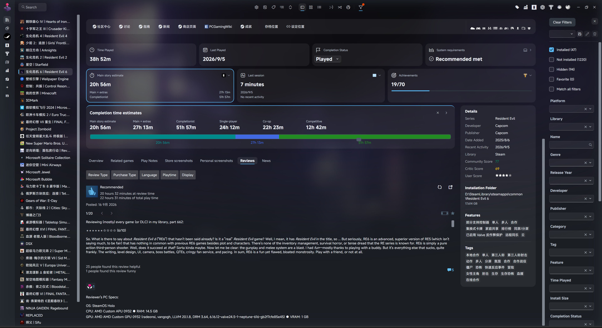
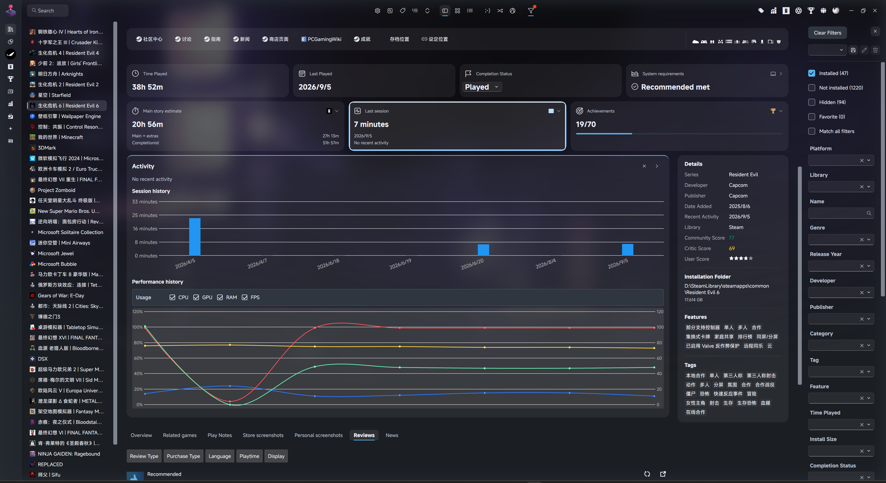
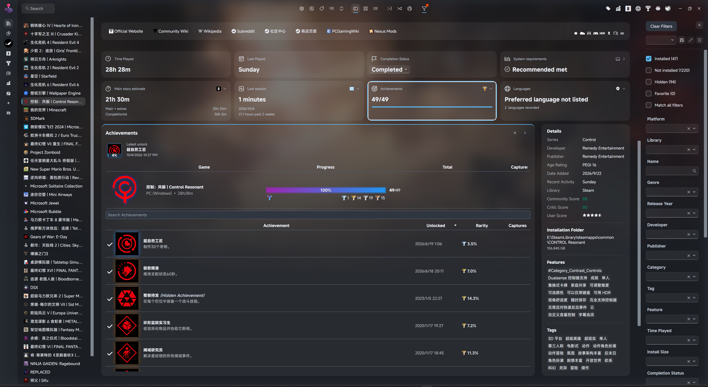
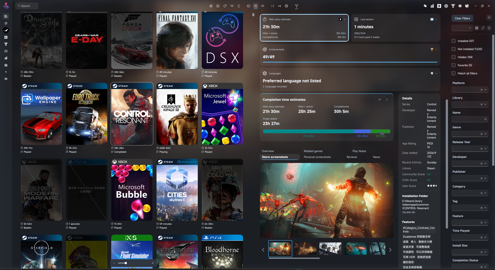

# Dune Rev

A dark, Fluent-inspired theme for Playnite Desktop.

面向 Playnite 桌面模式的深色 Fluent 风格主题。

[English](#english) · [简体中文](#简体中文) · [Screenshots / 截图](#screenshots--截图) · [Changelog](CHANGELOG.md)

**Current release / 当前版本：[2.3.0](https://github.com/hugsyf/dune-rev/releases/tag/v2.3.0)**

## Screenshots / 截图

These captures use optional extensions and game metadata. Your layout and available content
depend on the extensions, theme settings and data in your library.

以下实机截图包含可选扩展与游戏元数据。实际布局和可用内容取决于已安装的扩展、主题设置与游戏库数据。

### Details View / 详情视图

Game logo and Hero media, play controls, metadata and expandable summary cards.

游戏 Logo 与 Hero 媒体、游玩操作、元数据和可展开的摘要卡片。

### Grid View / 网格视图

Rounded covers with platform or store banners, play time and completion status.

圆角封面搭配平台／商店横幅、游玩时间与完成状态。

### Grid Details View / 网格详情视图

Browse covers alongside a game's Hero, actions and plugin cards.

浏览封面时，在旁边查看游戏 Hero、操作区与插件卡片。

<strong>More: estimates, reviews, activity, achievements and screenshots / 更多：估时、评论、活动、成就与截图</strong>

**Completion estimates and Steam reviews / 通关估时与 Steam 评论**

Expand a summary card while keeping the content tabs available below it.

摘要卡片展开后，下方的内容页签仍可使用。

**Activity and recorded performance / 活动与性能记录**

Session history and a taller performance chart share the expanded activity panel.

活动展开区展示游玩历史，并为性能图表提供更充足的高度。

**Achievements / 成就**

Latest unlock and the achievement list appear in the expanded card.

展开卡片后，可查看最近解锁成就与成就列表。

**Store screenshots in Grid Details / 网格详情中的商店截图**

Store screenshots have their own tab with a preview and selectable thumbnails.

商店截图拥有独立页签，支持预览与缩略图选择。

## English

Based on [Dune](https://github.com/sakasakiking/Dune) by sakasakiking, Dune Rev combines
a low-glare library view with quick access to game information and extension content.

### Features

- **Three library layouts.** Details, Grid and Grid Details with rounded surfaces,
  game logos, screenshots and videos. Missing logos can fall back to the game title.
- **Cover banners.** Edge-to-edge platform or store/source strips follow the cover's
  rounded corners. PC games can show Steam, Epic or Xbox; consoles keep platform labels.
  Playnite/manual games prefer their first platform. Each preference can be switched off.
- **Expandable summaries.** Play time, completion status, achievements, completion
  estimates, activity, requirements, languages and DLC. Click a supported plugin card
  to expand its details; click again to collapse. Separate buttons open plugin windows.
- **Content tabs.** Overview, Related games, Play Notes, Store screenshots, Personal
  screenshots, Reviews and News are peers. Relevant extensions and their integration
  settings determine which tabs are available. Empty related-game sections are hidden.
- **Useful media and records.** Screenshot previews and thumbnails, notes editing,
  latest achievement unlocks, session history and recorded performance charts.
- **Quieter cover controls.** Multi-copy selection appears below covers on hover or
  keyboard focus. Single-copy games omit it. Play/details actions also support keyboard
  focus; personal-score badges and reduced cover motion are optional.
- **Adjustable presentation.** ThemeModifier controls Hero size, blur and shading,
  content widths, summary visibility, panel heights, cover labels and colors.
  The optional top-bar shortcut opens theme settings.
- **Consistent theme surfaces.** Matching toolbar feedback, tab typography, checkboxes
  and translucent dropdowns; scoped button styles for supported plugin panels.
  Extensions still provide their own data, commands and some internal controls.

### Installation

Requires **Playnite 10.57 or newer**. Extensions are optional.

1. Download a published `.pthm` from [Releases](https://github.com/hugsyf/dune-rev/releases)
   and open it to install.
2. Select **Dune Rev** in Playnite's Desktop theme settings.
3. Install any extensions you want from Playnite's add-on browser, then enable their
   theme integrations in the extension settings.

The theme is also available through the
[Playnite add-on page](https://playnite.link/addons.html#DuneRev_aa8df0f9-9406-4ea6-a31a-3bd13853fd40).

Achievement integration uses **Playnite Achievements**. Latest-unlock display requires
**4.0 or newer**. Users keeping SuccessStory can use Dune Rev 1.1.1.

### Optional extensions

Install only the content you want. The theme does not fetch or record extension data itself.

| Extension | What it adds |
| --- | --- |
| Extra Metadata Loader | Game logos and videos |
| BackgroundChanger | Alternative backgrounds |
| Playnite Achievements | Progress, latest unlock and achievement list |
| HowLongToBeat | Available completion estimates and progress |
| GameActivity | Last session, recent activity, session history and recorded performance |
| SystemChecker | System requirements status and details |
| CheckLocalizations | Preferred-language summary and interface/audio/subtitle support |
| CheckDlc | DLC counts, ownership and all/owned/not-owned lists |
| Play Notes | Notes tab with the plugin's editing and import controls |
| Game Relations | Same-series and similar games from your library |
| Steam Store Screenshots Viewer | Store screenshot preview, thumbnails and viewer commands |
| ScreenshotsVisualizer | Personal screenshots and an optional native grid gallery |
| Review Viewer | Steam reviews and review filters |
| Steam News and Players Viewer | News and current players online |
| DuplicateHider | Selection between multiple copies of a game |
| Library Management | Feature icons |
| ThemeExtras | Favorites, completion-status/rating editing, banner overrides and settings command |
| ThemeModifier | Theme layout, visibility and appearance settings |

### Customize the theme

Install **ThemeModifier** to change theme options. The top-bar settings shortcut
also requires **ThemeExtras**. The options are grouped by purpose:

| Settings group | Main controls |
| --- | --- |
| Global layout | Top bar, compact Hero, blur/shading, reduced motion and title fallback |
| Details View layout | Content/sidebar widths and game logos |
| Grid View layout | Details-pane width and logo size |
| Summary and extension content | Summary cards, detailed summaries, language and DLC details |
| Extension panels | Notes, related games, screenshots, rating editing and panel/chart heights |
| Grid cover display | Banners, store preference, manual-game fallback, copy selection and score badges |
| Colors | Window, card, popup, border and icon colors |

Key defaults in a fresh installation:

| Option | Default |
| --- | --- |
| Platform/source cover banners | On |
| Prefer store/source banners for PC games | On |
| Prefer platform banners for Playnite/manual games | On |
| Multi-copy selector on hover/focus | On |
| Notes, related games, store and personal screenshot integrations | On, when available |
| Missing-logo title fallback and theme-settings shortcut | On, when available |
| Personal-rating editing through ThemeExtras | On, when available |
| Compact Hero, detailed summaries and reduced cover motion | Off |
| Personal-score badges on Grid covers | Off |
| Prefer ScreenshotsVisualizer's native grid gallery | Off |
| Performance chart minimum height | 360 px |

To use the personal screenshot grid, enable the matching picture-list integration
in **ScreenshotsVisualizer** as well as the theme preference. Set preferred languages
in **CheckLocalizations** for its summary. GameActivity performance charts require
performance data recorded by the plugin.

#### Custom cover banners

Bundled platform/store artwork works without ThemeExtras. ThemeExtras can supply
banner overrides and preserve the banner folder during theme updates.

Put custom PNGs in the installed theme's folders below, using the corresponding
name or identifier as the filename:

| Folder | Filename example or matching rule |
| --- | --- |
| `Images/Banners/PlatformSpecId` | `pc_windows.png` |
| `Images/Banners/PlatformName` | Exact platform name + `.png` |
| `Images/Banners/PluginId` | Library plugin GUID + `.png` |
| `Images/Banners/SourceName` | Exact source name + `.png` |

Restart Playnite after changing banner files. For a game with several platforms,
the banner uses its first platform; the metadata row can still list all platforms.

### Help and feedback

If a card or tab is missing, check that its extension is installed, its theme
integration is enabled, the theme preference is on, and the selected game has
the relevant data. Play Notes also provides an empty-state prompt for creating notes.

See the [changelog](CHANGELOG.md) for changes. Report problems through
[GitHub Issues](https://github.com/hugsyf/dune-rev/issues), including the view,
a screenshot, relevant extensions and the Playnite log when the theme fails to load.

### Credits

Based on [Dune](https://github.com/sakasakiking/Dune), with design inspiration from Mythic.
Platform and store/source banner artwork comes from
[KNARZnite](https://github.com/HerrKnarz/Playnite-Theme-KNARZnite);
its MIT license and source revision are included with the banners.
Dune Rev is distributed under the [MIT License](LICENSE).

---

## 简体中文

Dune Rev 基于 sakasakiking 的 [Dune](https://github.com/sakasakiking/Dune)，
以低眩光的深色界面展示游戏库，并整合常用游戏信息与扩展内容。

### 主要特性

- **三种游戏库布局。** 详情、网格与网格详情视图，支持圆角界面、游戏 Logo、截图与视频。
  没有 Logo 时可以回退显示游戏标题。
- **封面平台／来源横幅。** 横幅填满封面宽度并贴合圆角。PC 游戏可优先显示 Steam、Epic、Xbox
  等商店／来源，主机游戏保留平台标签；Playnite／手动添加的游戏优先显示第一个平台。
  显示横幅与两种优先策略均可独立关闭。
- **可展开的摘要卡片。** 展示游玩时间、完成状态、成就、通关估时、活动、配置需求、语言与 DLC。
  点击支持展开的插件卡片查看详情，再次点击收起；单独按钮可打开插件窗口。
- **并列内容页签。** 总览、库内关联游戏、Play Notes、商店截图、个人截图、评论与新闻。
  可用页签取决于对应扩展及其集成设置，关联游戏中无内容的分组自动隐藏。
- **媒体与记录。** 截图预览和缩略图、笔记编辑、最近解锁成就、游玩历史与已记录的性能图表。
- **更简洁的封面操作。** 多副本选择移至封面下方，悬停或键盘聚焦时出现；单副本不显示。
  游玩／详情按钮也支持键盘聚焦，可选择显示个人评分或减少封面动效。
- **可调布局与外观。** 通过 ThemeModifier 调整 Hero 尺寸、模糊与暗化、内容宽度、
  摘要显示、面板高度、封面标签与配色；可选的顶栏快捷入口直接打开主题设置。
- **统一主题控件。** 顶栏反馈、页签文字、复选框与半透明下拉菜单保持一致，
  支持的插件面板采用局部按钮样式。数据、操作逻辑与部分内部控件仍由扩展提供。

### 安装

需要 **Playnite 10.57 或更新版本**。扩展均为可选。

1. 从 [Releases](https://github.com/hugsyf/dune-rev/releases) 下载已发布的 `.pthm` 文件，打开安装。
2. 在 Playnite 的桌面主题设置中选择 **Dune Rev**。
3. 在 Playnite 附加组件浏览器中安装所需扩展，并在扩展设置中启用主题集成。

也可通过 [Playnite 附加组件页面](https://playnite.link/addons.html#DuneRev_aa8df0f9-9406-4ea6-a31a-3bd13853fd40)
安装主题。

成就集成使用 **Playnite Achievements**，最近解锁展示需要 **4.0 或更新版本**。
继续使用 SuccessStory 的用户可选择 Dune Rev 1.1.1。

### 可选扩展

按需安装即可。主题本身不抓取或记录扩展数据。

| 扩展 | 提供的内容 |
| --- | --- |
| Extra Metadata Loader | 游戏 Logo 与视频 |
| BackgroundChanger | 替代背景 |
| Playnite Achievements | 成就进度、最近解锁与成就列表 |
| HowLongToBeat | 有数据的通关估时与进度 |
| GameActivity | 上次游玩、近期活动、游玩历史与已记录的性能 |
| SystemChecker | 系统配置状态与详情 |
| CheckLocalizations | 首选语言摘要及界面／语音／字幕支持 |
| CheckDlc | DLC 数量、拥有情况与全部／已拥有／未拥有列表 |
| Play Notes | 独立笔记页签，使用插件的编辑与导入功能 |
| Game Relations | 游戏库中的同系列与相似游戏 |
| Steam Store Screenshots Viewer | 商店截图预览、缩略图与查看操作 |
| ScreenshotsVisualizer | 个人截图及可选的原生网格图库 |
| Review Viewer | Steam 评论与筛选 |
| Steam News and Players Viewer | 新闻与当前在线人数 |
| DuplicateHider | 多副本游戏的来源选择 |
| Library Management | 功能图标 |
| ThemeExtras | 收藏、完成状态／评分编辑、横幅覆盖与设置入口命令 |
| ThemeModifier | 主题布局、内容显示与外观设置 |

### 自定义主题

安装 **ThemeModifier** 后可调整主题选项。顶栏主题设置快捷入口还需要 **ThemeExtras**。
设置按用途分组：

| 设置分组 | 主要选项 |
| --- | --- |
| 全局布局 | 顶栏、紧凑 Hero、模糊／暗化、减少动效与标题回退 |
| 详情视图布局 | 内容／信息栏宽度与游戏 Logo |
| 网格视图布局 | 详情栏宽度与 Logo 尺寸 |
| 摘要与扩展内容 | 摘要卡片、详细摘要、语言与 DLC 详情 |
| 扩展面板 | 笔记、关联游戏、截图、评分编辑与面板／图表高度 |
| 网格封面显示 | 横幅、来源优先、手动游戏回退、副本选择与评分标记 |
| 配色 | 窗口、卡片、浮层、边框与图标颜色 |

首次安装时的主要默认值：

| 选项 | 默认值 |
| --- | --- |
| 封面平台／来源横幅 | 开启 |
| PC 游戏优先显示商店／来源横幅 | 开启 |
| Playnite／手动添加游戏优先显示平台横幅 | 开启 |
| 悬停／聚焦时显示多副本选择 | 开启 |
| 笔记、关联游戏、商店与个人截图集成 | 开启，对应功能可用时显示 |
| 缺 Logo 时显示标题、顶栏主题设置入口 | 开启，对应功能可用时显示 |
| 通过 ThemeExtras 编辑个人评分 | 开启，对应功能可用时显示 |
| 紧凑 Hero、详细摘要与减少封面动效 | 关闭 |
| 网格封面个人评分标记 | 关闭 |
| 优先使用 ScreenshotsVisualizer 原生网格图库 | 关闭 |
| 性能图表最小高度 | 360 px |

使用个人截图网格时，需要同时开启 **ScreenshotsVisualizer** 中对应的图片列表集成
和主题开关。语言摘要的首选语言在 **CheckLocalizations** 中设置。
GameActivity 的性能图表需要插件已经记录了性能数据。

#### 自定义封面横幅

内置平台／来源图片不依赖 ThemeExtras；ThemeExtras 可提供额外横幅覆盖，
并在更新主题时保留横幅文件夹。

将自定义 PNG 放入已安装主题的下列目录，以对应名称或标识符作为文件名：

| 目录 | 文件名示例或匹配规则 |
| --- | --- |
| `Images/Banners/PlatformSpecId` | `pc_windows.png` |
| `Images/Banners/PlatformName` | 完整平台名称 + `.png` |
| `Images/Banners/PluginId` | 库插件 GUID + `.png` |
| `Images/Banners/SourceName` | 完整来源名称 + `.png` |

修改图片后重启 Playnite。游戏有多个平台时，横幅使用第一个平台；
元数据行仍可列出全部平台。

### 帮助与反馈

如果缺少卡片或页签，请检查对应扩展是否安装、插件主题集成与主题开关是否开启，
以及当前游戏是否有相应数据。Play Notes 没有笔记时也会显示新建提示。

版本变化见 [changelog](CHANGELOG.md)。问题请通过
[GitHub Issues](https://github.com/hugsyf/dune-rev/issues) 反馈，并附上所在视图、
截图与相关扩展信息；主题载入失败时请同时提供 Playnite 日志。

### 致谢

基于 [Dune](https://github.com/sakasakiking/Dune)，部分设计参考 Mythic。
平台与商店／来源横幅来自 [KNARZnite](https://github.com/HerrKnarz/Playnite-Theme-KNARZnite)，
其 MIT 许可证与来源版本随横幅一并附带。
项目采用 [MIT 许可](LICENSE)。
