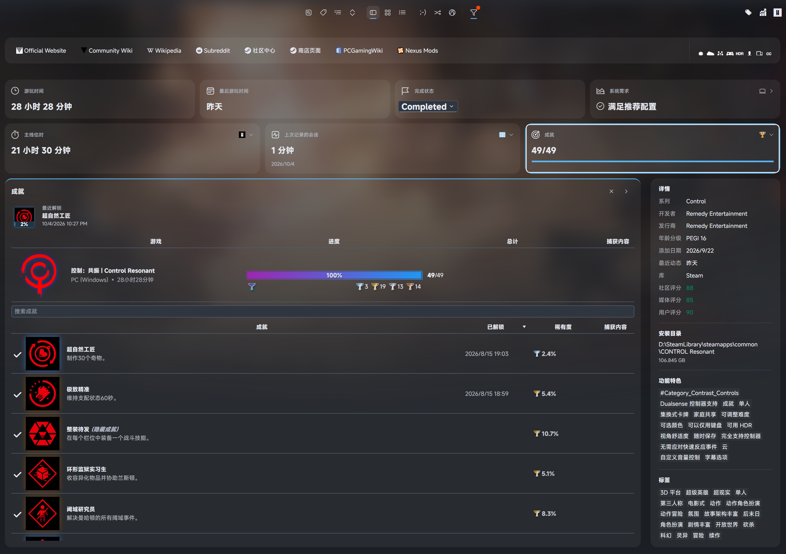
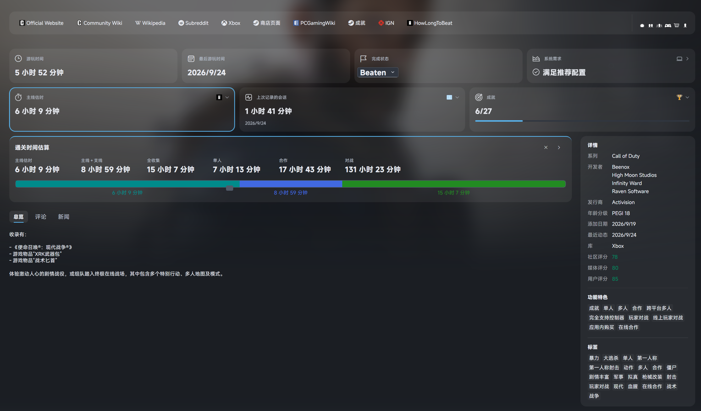

# Dune Rev

[English](#english) · [简体中文](#简体中文)

## Screenshots / 截图

**Details View / 详情视图**

**Grid Details View / 网格详情视图**

<strong>Plugin card details / 插件卡片展开详情</strong>

Click a plugin card to expand its details above the Overview, Reviews and News tabs.
点击插件卡片，可在总览、评论和新闻页签上方展开详情。

**Playnite Achievements / 成就卡片展开**

**HowLongToBeat / 通关估时卡片展开**

## English

Dune Rev is a dark, Fluent-inspired Desktop theme for Playnite, based on
[Dune](https://github.com/sakasakiking/Dune) by sakasakiking.

### Features

- Responsive Details and Grid views with game logos, screenshots and videos.
- Platform strips on Grid and Grid Details covers, with optional store/source
  banners through ThemeExtras and native platform artwork/text as a fallback.
- Adaptive cards for play time, achievements, activity, completion estimates,
  system requirements, language support and DLC.
- Clear plugin entry points and consistent dark controls.
- Click a plugin card to expand its details below the cards; click it again to
  collapse. Independent plugin windows have a separate entry point.
- Overview, reviews and news remain separate tabs below the expandable area.
- Long plugin lists grow up to the adjacent details card; short content stays compact.
- Customizable layout and display options through ThemeModifier.

### Installation

Requires **Playnite 10.57 or newer**. Extensions are optional; install the ones
you want to use. Achievement integration uses **Playnite Achievements**; its latest
unlock display requires version **4.0 or newer**. SuccessStory users can use Dune Rev 1.1.1.

1. Download the latest `.pthm` from [Releases](https://github.com/hugsyf/dune-rev/releases)
   and open it to install.
2. Select **Dune Rev** in Playnite's Desktop theme settings.

You can also install through Playnite's add-on browser or the
[add-on page](https://playnite.link/addons.html#DuneRev_aa8df0f9-9406-4ea6-a31a-3bd13853fd40).

### Supported extensions

| Extension | Integration |
| --- | --- |
| Playnite Achievements | Achievement progress, latest unlock and achievement list |
| HowLongToBeat | Available completion-time categories and progress |
| GameActivity | Last session, recent activity, session chart and recorded performance chart |
| SystemChecker | System requirements status and details |
| CheckLocalizations | Preferred-language summary and interface/audio/subtitle list |
| CheckDlc | DLC counts, ownership and all/owned/not-owned lists |
| Extra Metadata Loader | Game logos and videos |
| BackgroundChanger | Alternative backgrounds |
| DuplicateHider | Duplicate-copy selector |
| Library Management | Feature icons |
| ThemeExtras | Banners, favorites, editable completion status and personal rating |
| Play Notes | Separate notes and native plugin editing |
| Game Relations | Same-series and similar games in your library |
| ScreenshotsVisualizer | Personal screenshots; optional native grid gallery |
| Steam Store Screenshots Viewer | Store screenshots |
| Steam News and Players Viewer | News and players online |
| Review Viewer | Steam reviews |
| ThemeModifier | Layout and display customization |

### Setup tips

- Enable the desired theme integrations in each extension's settings.
- Use the top bar's theme-settings shortcut (ThemeExtras + ThemeModifier) for
  compact Hero layout, background blur/shading and reduced cover effects.
  Defaults preserve the standard layout. Compact Grid Hero uses a 600/1600 ratio;
  standard layout uses the configurable reference height.
- Use **ThemeModifier → Summary and extension content** to choose which cards,
  summaries and expandable details to display. Cards automatically rearrange to fit the window.
- Set preferred languages in **CheckLocalizations** for the language summary.
- If icons are missing, install **Segoe Fluent Icons** from
  [Microsoft's font downloads](https://learn.microsoft.com/windows/apps/design/downloads/#fonts).
- Restart Playnite after installing or updating extensions.
- Use **ThemeModifier → Grid cover display** for two independent switches:
  **Show platform/source labels** and **Prefer store/source labels for PC games**.
  Both default to enabled. Disable the first to restore full covers, or disable
  only the second to show Windows/platform labels instead of Steam, Epic or Xbox.
  Native theme artwork supports store/source fallback; **ThemeExtras** adds overrides
  and banner-folder preservation.
  Consoles retain their platform banners. Banner height is also adjustable.
- Custom images go in the theme's `Images/Banners/PlatformSpecId` (for example
  `pc_windows.png`), `PlatformName` (exact platform name), `PluginId` (library plugin
  GUID) or `SourceName` (exact source name). Restart Playnite after changing images.

- **ThemeModifier → Extension panels** controls ratings, Play Notes, relations and
  personal/store screenshots (enabled by default), plus the native screenshot grid
  (disabled by default). Enable the matching gallery
  integration in ScreenshotsVisualizer to use its grid. Native fields/notes remain available.
- Missing-logo title fallback is enabled by default. Grid personal score badges are
  optional; multi-copy selectors appear below covers on hover/keyboard focus; cover actions also support focus.

### Credits and support

Based on [Dune](https://github.com/sakasakiking/Dune), with inspiration from Mythic.
Platform and store/source banner artwork comes from
[KNARZnite](https://github.com/HerrKnarz/Playnite-Theme-KNARZnite);
its MIT license and source revision are included with the banners.
Distributed under the [MIT License](LICENSE).

See the [changelog](CHANGELOG.md) for release notes, and report theme issues through
[GitHub Issues](https://github.com/hugsyf/dune-rev/issues).

---

## 简体中文

Dune Rev 是面向 Playnite 桌面模式的深色 Fluent 风格主题，基于 sakasakiking 的
[Dune](https://github.com/sakasakiking/Dune) 开发。

### 主要特性

- 响应式详情与网格视图，支持游戏 Logo、截图和视频。
- Grid 与 Grid Details 封面支持平台标签，可通过 ThemeExtras 优先显示商店／来源横幅；
  平台图片与文字支持原生回退。
- 自适应卡片展示游玩时间、成就、活动、通关估时、系统需求、语言支持与 DLC。
- 清晰的插件入口和统一的深色控件。
- 点击插件卡片在下方展开详情，再次点击收起；插件独立窗口保留单独入口。
- 总览、评论与新闻作为独立页签，位于卡片展开区下方。
- 长插件列表可增长至并列详情卡片的高度，短内容保持紧凑。
- 通过 ThemeModifier 自定义布局与显示内容。

### 安装

需要 **Playnite 10.57 或更新版本**。扩展均为可选，可按需安装。成就集成使用
**Playnite Achievements**，最近解锁展示需要 **4.0 或更新版本**。
使用 SuccessStory 的用户可选择 Dune Rev 1.1.1。

1. 从 [Releases](https://github.com/hugsyf/dune-rev/releases) 下载最新 `.pthm` 文件，打开安装。
2. 在 Playnite 的桌面主题设置中选择 **Dune Rev**。

也可以通过 Playnite 内置附加组件浏览器或
[附加组件页面](https://playnite.link/addons.html#DuneRev_aa8df0f9-9406-4ea6-a31a-3bd13853fd40) 安装。

### 支持的扩展

| 扩展 | 集成内容 |
| --- | --- |
| Playnite Achievements | 成就进度、最近解锁与成就列表 |
| HowLongToBeat | 有数据的各类通关估时与进度 |
| GameActivity | 上次游玩、近期活动、游玩时间图与已记录的性能图 |
| SystemChecker | 系统配置状态与详情 |
| CheckLocalizations | 首选语言摘要与界面／语音／字幕列表 |
| CheckDlc | DLC 数量、拥有情况与全部／已拥有／未拥有列表 |
| Extra Metadata Loader | 游戏 Logo 与视频 |
| BackgroundChanger | 替代背景 |
| DuplicateHider | 重复副本选择 |
| Library Management | 功能图标 |
| ThemeExtras | 平台横幅、收藏、可编辑的完成状态与个人评分 |
| Play Notes | 独立笔记与插件原生编辑入口 |
| Game Relations | 库内同系列与相似游戏 |
| ScreenshotsVisualizer | 个人截图 |
| Steam Store Screenshots Viewer | 商店截图 |
| Steam News and Players Viewer | 新闻与在线人数 |
| Review Viewer | Steam 评论 |
| ThemeModifier | 布局与显示设置 |

### 使用提示

- 在各扩展设置中启用所需的主题集成。
- 顶栏主题设置入口需要 ThemeExtras 与 ThemeModifier，可设置紧凑 Hero 布局、
  背景模糊／暗化和减少封面动效；默认保留标准布局。
  紧凑网格 Hero 使用 600/1600 比例，标准模式使用可调参考高度。
- 在 **ThemeModifier → 摘要与扩展内容** 中选择显示的卡片、摘要信息与展开详情。
  卡片会随窗口宽度自动重排。
- 语言摘要的首选语言在 **CheckLocalizations** 中设置。
- 如果图标缺失，可从 [Microsoft 字体下载页面](https://learn.microsoft.com/windows/apps/design/downloads/#fonts)
  安装 **Segoe Fluent Icons**。
- 安装或更新扩展后，建议重启 Playnite。
- 在 **ThemeModifier → 网格封面显示** 中提供两个独立开关，均默认开启：
  **显示平台／来源标签**、**PC 游戏优先显示商店／来源标签**。
  关闭前者恢复完整封面；只关闭后者则显示 Windows 等平台标签，而非 Steam、Epic、Xbox。
  原生主题图片支持平台与来源回退，ThemeExtras 可提供额外横幅；主机游戏保留平台横幅。
- 自定义图片放入主题的 `Images/Banners/PlatformSpecId`（例如 `pc_windows.png`）、
  `PlatformName`（平台名称）、`PluginId`（库插件 GUID）或 `SourceName`（来源名称）。
  修改后重启 Playnite。ThemeExtras 会在主题更新时保留此文件夹。

- **ThemeModifier → 扩展面板** 调整个人评分、Play Notes、关联游戏与个人／商店截图，均默认开启。
  优先使用原生截图网格默认关闭；对应图库集成需在 ScreenshotsVisualizer 中配置。
  原生字段与笔记继续保留，未评分游戏也可以通过 ThemeExtras 直接打分。
- 缺 Logo 时的标题回退默认开启；网格个人评分默认关闭，副本选择默认开启。
  多副本来源入口位于封面下方，仅悬停或键盘聚焦时显示；单副本游戏隐藏入口。
  Playnite／手动添加游戏优先使用第一个平台横幅，可在网格封面设置中单独关闭此偏好。

### 致谢与反馈

基于 [Dune](https://github.com/sakasakiking/Dune)，部分设计参考 Mythic。
平台与商店／来源横幅图片来自 [KNARZnite](https://github.com/HerrKnarz/Playnite-Theme-KNARZnite)，
其 MIT 许可证及来源版本随横幅一并附带。
项目采用 [MIT 许可](LICENSE)。

版本更新见 [changelog](CHANGELOG.md)，主题问题可通过
[GitHub Issues](https://github.com/hugsyf/dune-rev/issues) 反馈。
